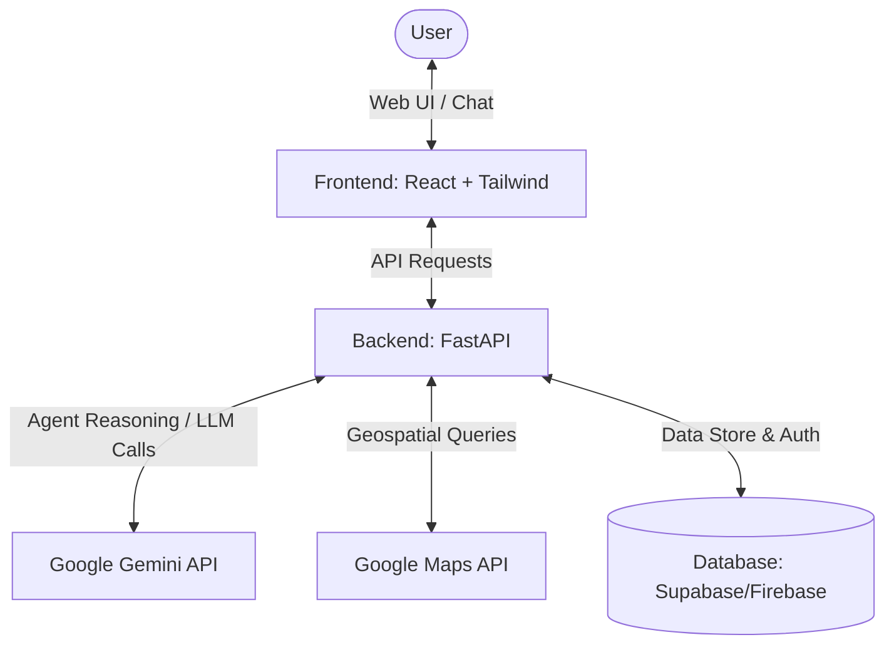
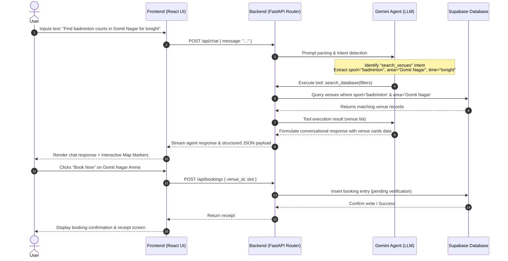

# SportSphere AI - Architecture Design
This document outlines the architecture, component interaction, and agentic workflows of the SportSphere AI platform.

---

## 🏛️ System Architecture Overview

SportSphere AI uses a decoupled client-server architecture with a centralized AI agent orchestrator to translate human conversational prompts into structured discovery and booking actions.

---

## 🧩 Core Components

### 1. Frontend (React + Tailwind CSS)
*   **Chat Interface:** A dynamic, floating assistant interface with message bubble styling, glassmorphism UI, and real-time streaming text answers.
*   **Interactive Discovery Map:** Embeds the Google Maps API, updating markers dynamically based on suggestions produced by the AI Agent.
*   **Booking Modal:** A checkout page containing time slot selectors, venue pricing details, and mock payment options.

### 2. Backend (FastAPI)
*   **REST Endpoints:** FastAPI hosts endpoints for chat routing, database queries, and manual facility discovery.
*   **Agent Orchestrator:** Implements an LLM-based router that parses input strings, extracts parameters (venue name, time, sport type, area of Lucknow), and acts as a tool-using agent.
*   **Validation Engine:** Checks for time overlap conflicts before writing reservation entries.

### 3. AI Agent (Gemini API)
*   **Intent Classification:** Determines if the user wants to *search venues*, *ask a general sports question*, *cancel a booking*, or *book a slot*.
*   **Parameter Extraction (NER):** Extracts variables such as:
    *   `sport`: "Badminton", "Cricket", "Swimming"
    *   `location`: "Gomti Nagar", "Hazratganj", "Indira Nagar"
    *   `time`: "Evening", "8 PM", "Tomorrow morning"
*   **Tool Calling:** Invokes local python tools to search Supabase database tables or check location distances via Google Maps API.

### 4. Database (Supabase / Firebase)
*   **Venues Table:** Stores venue details, capacities, sports supported, geo-coordinates, price per hour, and operating hours.
*   **Bookings Table:** Holds registration schedules, customer contact details, reservation timestamps, and payment statuses.

### 5. Maps API
*   **Geocoding & Places:** Converts colloquial location terms (e.g., "near Munshi Pulia") to exact coordinate bounds.
*   **Distance Matrix:** Calculates ETA and travel distances to help rank recommendations.

---

## 🔄 User → AI Agent → Recommendation → Booking Flow

Below is the structured execution flow for a typical conversational request:

---

## 🛠️ Planned Agent Tools
- `get_venues_by_sport(sport: str, area: str)`: Queries database for matching arenas.
- `check_slot_availability(venue_id: str, date: str)`: Inspects if requested hour is free.
- `calculate_distance(origin: str, destination: str)`: Estimates driving time inside Lucknow.
- `create_reservation(venue_id: str, user_id: str, slot: str)`: Writes booking status to database.
